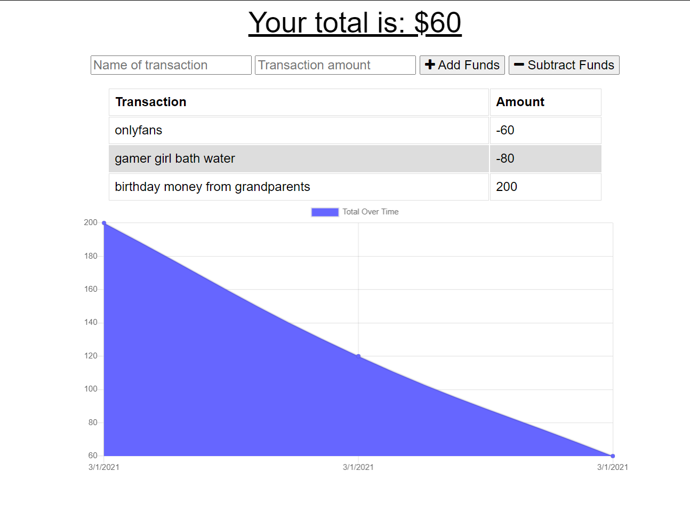

# budget-buster

## Description 

With budget buster at https://frozen-beyond-72427.herokuapp.com/ a single user can keep track of their recent spending. The app can be downloaded or used from the browser and will still record transactions if offline and update once it comes back online. 

## Table of Contents

* [Installation](#installation)
* [Usage](#usage)
* [License](#license)
* [Questions](#questions)

## Installation

Clone the repository from https://github.com/BeatyPete/budget-buster. Then open the directory with your console and use 'npm install' to install the required packages.

## Usage 

Users will likely want to start with an initial amount that they have, followed by subsequent purchases. Use the input labeled 'name of transaction' to enter a short description, and the input labeled 'transaction amount' for the monetary change of your current transaction. After filling these out use either of the buttons to either subtract or add the amount.  

## License

MIT

## Questions?
Github: [beatypete](https://github.com/beatypete)
Feel free to email me with any questions at akira941@gmail.com
    
